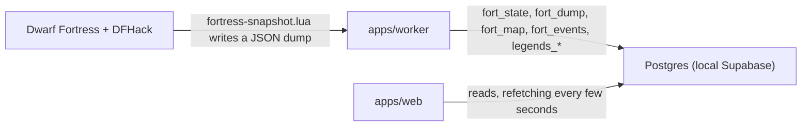

# Dwarf Fortress Manager

A live overview of a running Dwarf Fortress game. A small worker asks DFHack for a full dump of the loaded fortress on a timer, stores it in Postgres, and a web app renders it: population and mood, every dwarf, every item, workshops and jobs, the map one z-level at a time, the announcement chronicle, and a browser for the world's exported legends.

The game is never touched by the browser. Each DFHack query pauses the simulation for a moment, so exactly one process talks to the game and everything else reads the database.




## What each app does

| App | Package | Role |
| --- | --- | --- |
| `apps/worker` | `@fortress/worker` | Installs [`fortress-snapshot.lua`](apps/worker/src/dfhack/fortress-snapshot.lua) into the game's `dfhack-config/`, runs it over DFHack's remote console every `DF_POLL_MS` (map included every `DF_MAP_POLL_MS`), reads the dump file back, and writes Postgres. Also imports any `*-legends.xml` / `*-legends_plus.xml` exports found next to the game. Writes `status: menu` or `offline` when no fortress is loaded or the game is unreachable, keeping the last dump in place. |
| `apps/web` | `@fortress/web` | TanStack Start app behind Supabase auth. `/fortress` overview, `/fortress/dwarves`, `/fortress/items`, `/fortress/work`, `/fortress/map`, `/fortress/chronicle`, `/legends`, plus `/activity-logs` for the worker's own log lines. |
| `apps/supabase` | `@fortress/supabase` | Local Supabase stack: Postgres, GoTrue auth, Studio, Mailpit. Holds the SQL migrations. |

Shared packages: `@fortress/db-drizzle` (hand-written Drizzle schema, the `postgres_db` client, and the fortress payload types), `@fortress/ui` (vendored shadcn/ui components and the app layout), `@fortress/tsconfig`, `@fortress/biome-config`.

## Stack

| Concern | Choice | Why |
| --- | --- | --- |
| Server + router + data fetching | TanStack Start | File-based routes, typed `Link`s, and `createServerFn` so a route file can hold both its Postgres query and the component that renders it. |
| DB access | Drizzle ORM (`postgres-js`) | The schema in [packages/db-drizzle/src/schema.ts](packages/db-drizzle/src/schema.ts) is the single source of truth; tables, columns, and query results are typed end to end with no codegen. SQL migrations in `apps/supabase/migrations/` are kept in sync by hand. |
| Database + auth | Supabase (CLI, local) | One container set for Postgres, auth, Storage, and Studio. Auth goes through `@supabase/ssr` so it works inside server functions. |
| Client state | TanStack Query | Caches the user and polls the fortress reads every few seconds. |
| UI | shadcn/ui + Tailwind v4 + lucide-react + sonner | Owned source in `packages/ui`, no runtime UI dependency. |
| Monorepo | Bun workspaces + Turborepo | Fast installs, cached typecheck/lint, parallel `dev`. |
| Lint / format | Biome + ESLint | Biome is the fast default; ESLint adds the React, Query, and Router plugins. |
| Game side | DFHack remote console + Lua | The Lua script walks units, items, buildings, jobs, announcements, and map blocks and writes one JSON file; the worker talks to DFHack over TCP on `127.0.0.1:5000`. |

---

## Repository layout

```text
fortress/
├── apps/
│   ├── web/         TanStack Start app. Routes, shadcn UI, auth, server functions.
│   ├── worker/      DFHack poller. Lua dump script, RPC client, Postgres writer,
│   │                legends XML importer.
│   └── supabase/    Local Supabase config (ports, auth providers, email
│                    templates) and SQL migrations.
├── packages/
│   ├── db-drizzle/      Drizzle schema, drizzle-kit config, the `postgres_db`
│   │                    client, and fortress payload types. Imported by both
│   │                    apps as `@fortress/db-drizzle`.
│   ├── ui/              shadcn/ui components, app layout, theme CSS.
│   ├── tsconfig/        Shared `base.json` + `react.json` tsconfigs.
│   └── biome-config/    Shared Biome rules.
└── turbo.json, package.json, bun.lock, scripts.js
```

### Server functions next to their screens

[apps/web/src/routes/\_authenticated/\_app/activity-logs/index.tsx](apps/web/src/routes/_authenticated/_app/activity-logs/index.tsx) shows the smallest version of the pattern in one file: a `createServerFn` that queries Postgres through Drizzle, a component that calls it with `useQuery`, and the file-route binding. The fortress pages share their reads instead, in [apps/web/src/lib/fortress/server.ts](apps/web/src/lib/fortress/server.ts) and [apps/web/src/lib/legends/server.ts](apps/web/src/lib/legends/server.ts), because several pages read the same dump.

Browser code that needs the fortress constants (`STRESS_LABELS`, `DF_MONTHS`, `FORT_FLAG`, `LEGENDS_KINDS`) imports them from `@fortress/db-drizzle/fortress-types`. The package entry also creates the Postgres client, which must never reach the client bundle.

### Authentication

Auth server functions live in [apps/web/src/lib/auth/server.ts](apps/web/src/lib/auth/server.ts): `loginFn` (magic link), `verifyCodeFn` (OTP), `oauthFn` (GitHub), `logoutFn`, and `getCurrentUser`. The root route calls `getCurrentUser` once per navigation, caches it in React Query under `['user']`, and the `_authenticated` segment redirects to `/auth/login` when there is no user. After login you land on `/fortress`.

---

## Running locally

### Prerequisites

- **Dwarf Fortress** with **DFHack** installed, and DFHack's remote server enabled on port 5000 (`dfhack-config/remote-server.json`, the default). The worker defaults to the Steam copy inside the CrossOver "Steam" bottle; set `DF_GAME_DIR` in `apps/worker/.env` if the game lives elsewhere.
- **Node 20.18.0** - pinned in [.nvmrc](.nvmrc). `nvm use` will switch you.
- **Bun ≥ 1.2** - `curl -fsSL https://bun.sh/install | bash`
- **Supabase CLI** - `brew install supabase/tap/supabase` (also installed as a dev dependency for the `npx supabase` calls).
- **Docker Desktop** running - Supabase's local stack runs in containers.

### First-time setup

```bash
nvm use
bun install
bun run dev
```

`bun run dev` runs five idempotent steps in order, each individually scriptable:

1. `env:check` -- copies `.env.example` to `.env` for each app/package that doesn't already have one.
2. `dev:db` -- boots the Supabase containers (Postgres, GoTrue, Studio, Mailpit, ...).
3. `env:sync` -- reads `supabase status -o env` from the running stack and splices the generated `SUPABASE_ANON_KEY`, `SUPABASE_SERVICE_ROLE_KEY`, S3 keys, and JWT secret into every local `.env`. **Safety guard**: any `.env` whose `SUPABASE_API_URL` or `SUPABASE_DB_URL` points at a non-local host is skipped, so this can never clobber prod credentials.
4. `db:migrate` -- applies any new SQL migrations under `apps/supabase/migrations/`. No-op when nothing has changed.
5. `turbo run dev --parallel` -- starts the web app and the worker.

Start Dwarf Fortress and load a fortress. The worker logs one line per dump (`dump ok (... KB, game paused ... ms): <fort> · <units> units, <items> items`), and the web app fills in within a few seconds.

### Day-to-day

```bash
bun run dev           # same five steps, all idempotent
```

Or run individual services:

```bash
bun run dev:db        # Supabase stack only
bun run dev:web       # TanStack Start app at http://127.0.0.1:3000
bun run dev:worker    # DFHack poller (tsx watch)
bun run env:check     # Create any missing .env from its .env.example
bun run env:sync      # Pull anon/service-role/S3 keys from `supabase status` into the local .env files
bun run db:migrate    # Apply any new migrations (no-op when already applied)
bun run db:reset      # DESTRUCTIVE - drop the local DB and re-apply migrations
```

Useful local URLs while `dev:db` is running:

| Service | URL |
| --- | --- |
| Web app | <http://127.0.0.1:3000> |
| Supabase Studio (DB UI) | <http://127.0.0.1:54423/project/default> |
| Supabase API | <http://127.0.0.1:54421> |
| Mailpit (catches outgoing emails, including magic-link codes) | <http://127.0.0.1:54424> |

> The Supabase ports are defined in [apps/supabase/config.toml](apps/supabase/config.toml) (`54421` API, `54422` DB, `54423` Studio, `54424` Mailpit).

### Worker configuration

All in `apps/worker/.env` (see [apps/worker/.env.example](apps/worker/.env.example)):

| Variable | Default | Meaning |
| --- | --- | --- |
| `DF_GAME_DIR` | CrossOver Steam bottle path | Folder containing `Dwarf Fortress.exe` and `dfhack-config/`. |
| `DF_LEGENDS_DIR` | `DF_GAME_DIR` | Folder scanned for `*-legends.xml` and `*-legends_plus.xml`. |
| `DFHACK_HOST` / `DFHACK_PORT` | `127.0.0.1` / `5000` | DFHack remote console. |
| `DF_POLL_MS` | `30000` | Units, items, buildings, jobs, and announcements. |
| `DF_MAP_POLL_MS` | `300000` | The map pauses the game for a few seconds, so it runs less often. |
| `DF_IMPORT_LEGENDS` | `1` | Set to `0` to skip the legends import. |

### Checks

```bash
bun run typecheck     # tsc --noEmit on every workspace
bun run lint          # biome check on every workspace
bun run format        # biome format --write on every workspace
```

ESLint also runs on `apps/web` if you call it directly (`cd apps/web && bunx eslint src`). A few vendored shadcn files in `packages/ui/src/components/ui/` are excluded from Biome in [packages/ui/biome.json](packages/ui/biome.json).

---

## How to work in this repo

### Adding a screen + query

1. Create the file route under `apps/web/src/routes/...` (TanStack Router conventions: `index.tsx`, `_authenticated.tsx` for layout segments, `-components/` for route-private components). The sidebar entries live in [apps/web/src/routes/\_authenticated/\_app.tsx](apps/web/src/routes/_authenticated/_app.tsx).
2. Define a `createServerFn({ method: 'GET' }).handler(async () => …)` that uses `postgres_db` + `schema.*` from `@fortress/db-drizzle`, either in the route file or in `apps/web/src/lib/<area>/server.ts` when several pages share it.
3. Call it from `useQuery` (or `useMutation` for writes). Errors thrown server-side surface in React Query's `error`.

### Adding to the dump

The dump shape is defined once in [packages/db-drizzle/src/fortress-types.ts](packages/db-drizzle/src/fortress-types.ts) and produced by [apps/worker/src/dfhack/fortress-snapshot.lua](apps/worker/src/dfhack/fortress-snapshot.lua). Add the column to the Lua row builder and the matching TypeScript type; the worker re-installs the script into the game folder on its next start.

### Adding a table

1. Add the `pgTable(...)` definition to [packages/db-drizzle/src/schema.ts](packages/db-drizzle/src/schema.ts).
2. Write the SQL in a new `apps/supabase/migrations/<UTC-timestamp>_<name>.sql`. The filename prefix (`YYYYMMDDHHMMSS_…`) is what Supabase orders by; copy the format of the existing migrations. **Editing a migration after it's been applied won't re-run it** - always create a new file for changes.
3. `bun run db:migrate` (or just `bun run dev`, which chains migrate before starting the apps).
4. Re-export anything you need in [packages/db-drizzle/src/types.ts](packages/db-drizzle/src/types.ts) (`InferSelectModel`, `InferInsertModel`).

If you'd rather have drizzle-kit produce the SQL, run `npx drizzle-kit generate` from `packages/db-drizzle` after editing the schema; it writes into `packages/db-drizzle/drizzle/`. Commit only one version. If a local migration was applied with stale content, `bun run db:reset` wipes the local DB and re-applies everything.

### Adding a shadcn component

```bash
cd apps/web
bun run ui add <component-name>
```

### Adding a new app or package

1. Create the folder under `apps/` or `packages/` with a `package.json` named `@fortress/<name>` and `"private": true`.
2. `extends` the shared configs:

   ```jsonc
   // tsconfig.json
   { "extends": "../../packages/tsconfig/base.json" /* or react.json */ }
   ```

   ```jsonc
   // biome.json
   { "extends": ["../../packages/biome-config/biome.json"] }
   ```

3. Run `bun install` at the repo root to wire up the workspace symlinks.

### Auth flow

```text
visitor ──► /auth/login ──► loginFn (magic link emailed via Mailpit)
                       └─► verifyCodeFn (OTP) ──► invalidate ['user']
                                                └─► redirect to /fortress
authenticated ──► /_authenticated/* (guarded by context.user)
                                  └─► getCurrentUser cached in ['user']
logout ──► logoutFn ──► invalidate ['user'] ──► redirect to /auth/login
```

---

## Packages used

- [tanstack/start](https://tanstack.com/start/latest) · [tanstack/react-router](https://tanstack.com/router/latest) · [tanstack/react-query](https://tanstack.com/query/latest)
- [drizzle-orm](https://orm.drizzle.team) · [postgres-js](https://github.com/porsager/postgres)
- [supabase](https://supabase.com) (DB + auth via `@supabase/ssr`)
- [DFHack](https://docs.dfhack.org) (remote console and Lua API)
- [shadcn/ui](https://ui.shadcn.com/docs/components) · [tailwindcss v4](https://tailwindcss.com) · [lucide icons](https://lucide.dev) · [sonner](https://sonner.emilkowal.ski/)
- [biome](https://biomejs.dev) · [eslint](https://eslint.org) · [turborepo](https://turbo.build) · [bun](https://bun.sh)

## License

MIT - see [LICENSE](LICENSE).
