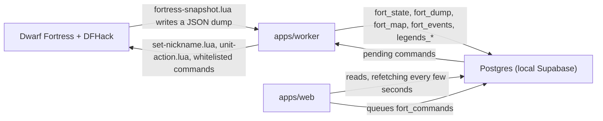
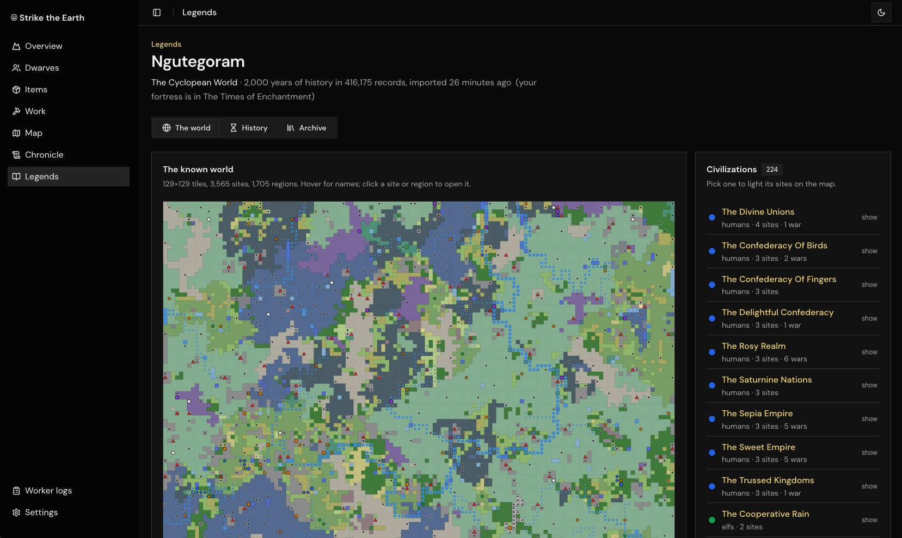
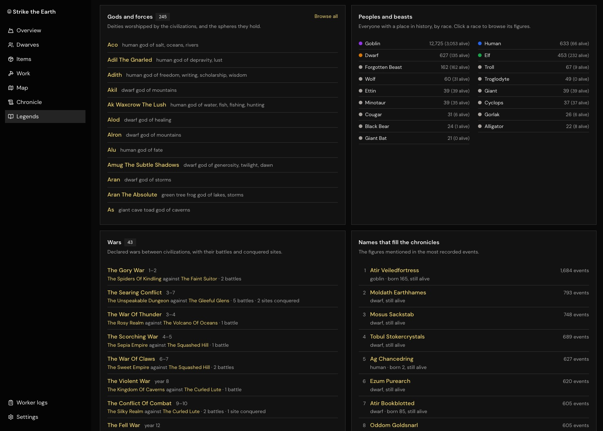

# Dwarf Fortress Manager

A companion app for a running Dwarf Fortress game. A worker next to the game reads the loaded fortress through DFHack on a timer and stores it in Postgres; a web app turns that into pages a player can use: what needs attention and how to fix it in the game, every dwarf with a full character sheet and role-play tools, the stores, the work queue, the map, the announcement chronicle, and a browser for the world's exported legends.

One search box in the header (⌘K / Ctrl+K) looks across all of it at once: pages, dwarves and other creatures, items, buildings and zones, chronicle entries, and legends records such as figures, sites, civilizations and artifacts.

The app can also act on the game, but only through a short whitelist: nicknames, titles, jumping the camera to a dwarf, a handful of DFHack maintenance commands and a few clearly marked cheats. The browser never talks to the game. It queues a command in Postgres, and the worker, the only process connected to DFHack, carries it out.







## What's in the app

### The fortress

| Page | What it shows |
| --- | --- |
| **Overview** `/fortress` | Citizens, who is at work, created wealth and dangers on the map; what needs your attention, how the fortress feels, and the story so far, with entries since your last visit marked. |
| **Dwarves** `/fortress/dwarves` | Everyone on the map as cards or a table, split into citizens, residents, visitors, animals and hostiles, with a "could use your help" strip on top. Click anyone for a drawer, or open their full page. |
| **Items** `/fortress/items` | What the fortress keeps, what it is running short of and what to do about it, then every item on the map. Each item has its own page. |
| **Work** `/fortress/work` | What a thriving fortress has and what yours is missing, the work queue, and every workshop with who can work it. |
| **Map** `/fortress/map` | One z-level at a time from the last map dump, with dwarves, creatures and hostiles marked. Zoom, pan, `<` / `>` to change level, and show unrevealed rock if you want to. |
| **Chronicle** `/fortress/chronicle` | Every announcement since the worker started, filterable to notable events, cancellations or combat. Announcements undone by loading an earlier save are left out. |
| **Nickname dwarves** `/nickname-dwarves` | Nickname ideas built on what sets each citizen apart from the rest of the fortress, optionally written by a language model, queued into the game in one go. |

Advice comes with step-by-step guides you can tick off. Where DFHack can do the fix (resume suspended jobs, turn on `tailor` or `autofarm`, import standard work orders, and so on), the guide offers it as a one-click command.

### A dwarf's page

The drawer and the full page `/fortress/dwarves/$id` share the same tabs; the full page keeps the open tab in the URL (`?tab=mind`).

| Tab | What it shows |
| --- | --- |
| **Overview** | A few sentences on who they are and what troubles them, with a guide for each trouble; bodily needs, the needs they most long to meet, best skills, recent thoughts, the chronicle entries that name them, their rooms and workshops. |
| **Mind** | Every need with the game's own words for how well it is met (unfettered to badly distracted) and their overall focus; personality and beliefs in plain sentences; dreams and gods; likes and dislikes; thoughts; long-term and core memories. |
| **Skills & body** | Every skill grouped by kind, with progress to the next level, rust, and a warning when they are good at something their labors do not allow; attributes compared with a typical member of their race; injuries by body part, syndromes (drink shows up here, not as a wound); work details, squad and offices. |
| **People** | Family and bonds, friends, grudges and acquaintances as the game records them, with links to anyone on the map; the civilizations, faiths and groups they belong to. |
| **Role play** | A character sheet to play them from, story hooks drawn from their grudges, dreams, losses and wasted talents, what sets them apart from everyone else, private notes kept per fortress, and, with a language model configured, their own voice: a monologue, a diary entry, tavern gossip, a biography, or a conversation where you ask them questions. |
| **Actions** | Show them in the game, set their nickname or a custom title, what would help them (from their unmet needs and likes), and cheats behind a confirmation: clear stress, fulfil every need, heal completely. |
| **Gear** | Everything they carry and wear. |

### Legends

Import a world's exports and `/legends` becomes a reader for its history: a world map drawn with the game's world sprites, a chart of the ages you can drag across to read a span's chronicle, stories worth reading (the bloodiest battles, the deadliest beasts, the lives most written about), the figures and races in history, an archive of every record and event, and a page per record with every raw field. You can pin anything to a private journal with notes, and a "recently read" trail picks up where you left off. An optional narrator retells a record, a span or a story in a chosen voice.

### Everywhere

- **Search** in the header (⌘K / Ctrl+K) finds pages, dwarves and creatures from the last dump, items, buildings and zones, chronicle entries, and legends records by name. Results are grouped, show the game's sprites, and say when a group has more matches than fit.
- **Ask how to…** next to the search (⌘J / Ctrl+J) opens a sidebar where a language model answers questions about playing, with a summary of your fortress attached: population, stocks, workshops, the job queue and what the app itself flags. DFHack commands it suggests (`workorder ConstructBed 10`, `orders import library/basic`, ...) show up as cards you can copy, or run after reading and confirming them. Needs the model settings below.
- **Alerts**: while the app is open in a tab it watches the fortress and speaks up about deaths, threats, strange moods, births, arrivals and more. Choose which in Settings.
- **Walking dwarves**: your citizens potter along the bottom of the window. Knock them over with the cursor, or turn them off in Settings.
- **Refresh** at the top right reads the game now. Useful with automatic reads turned off.
- **Settings** `/settings`: look, text size and motion; alerts; how often the game is read, or only on refresh; whether guides run DFHack commands in one click or show them to copy; the worker's connection status and recent commands; legends worlds and the narrator.
- **Worker logs** `/activity-logs`: the worker's own log lines.

## How it talks to the game

### Reading

On start the worker copies [fortress-snapshot.lua](apps/worker/src/dfhack/fortress-snapshot.lua) into the game's `dfhack-config/` folder. It then runs the script over DFHack's remote console on the schedule chosen in **Settings → Game connection** (every 30 s by default, or only when asked); the script walks units, items, buildings, jobs and announcements and writes one JSON file, which the worker reads back into Postgres. The map is included at most every `DF_MAP_POLL_MS`. Each dump pauses the game while it runs: a couple of seconds for a young fort, longer as units and items pile up. The worker logs how long each one took, and Settings shows the last one.

The refresh button at the top right of every page asks for a dump now, whatever the schedule. The schedule and the requests live in the single-row `fort_worker` table, which the worker checks every `DF_COMMAND_POLL_MS`, so changes apply without a restart.

Units carry more than the columns suggest: `look` holds everything the game's layered graphics read (tissues, appearance modifiers, body parts, worn items), so the web app can draw each dwarf the way the game does, and `sheet` holds what the game's unit screens show (attributes, every skill with experience, needs, preferences, dreams, memories, relationships, gods, groups, wounds, work details).

When no fortress is loaded the worker writes `status: menu`, and `offline` when the game is unreachable; the last dump stays in place and the pages say so.

### Writing

The web app queues commands in `fort_commands`. Apart from assistant commands, it only sends a key from a whitelist:

| Kind | What it does | Defined in |
| --- | --- | --- |
| `set_nickname` | Sets a citizen's nickname through DFHack's nickname API. | [set-nickname.lua](apps/worker/src/dfhack/set-nickname.lua) |
| `dfhack` | Runs one of `DFHACK_ACTIONS`: `unsuspend`, `enable tailor`, `orders import library/basic`, `combine all`, ... | [fortress-types.ts](packages/db-drizzle/src/fortress-types.ts) |
| `unit_action` | Runs one of `UNIT_ACTIONS` on one unit: `reveal`, `title`, `calm`, `fillneeds`, `heal`. | [fortress-types.ts](packages/db-drizzle/src/fortress-types.ts), [unit-action.lua](apps/worker/src/dfhack/unit-action.lua) |
| `console` | Runs a DFHack console line as written, from the assistant, after the player has read it in full and confirmed. No whitelist; only commands that quit the game (`die`) are refused, by the web app and again by the worker. | [fortress-types.ts](packages/db-drizzle/src/fortress-types.ts) (`checkConsoleCommand`), [actions.ts](apps/worker/src/dfhack/actions.ts) |

The worker picks commands up every `DF_COMMAND_POLL_MS`, looks the key up in the whitelist, and the Lua side checks again (is the unit alive, one of ours, on the map) before it changes anything. After running commands it dumps straight away so the pages catch up. With **one-click commands** turned off in Settings, the pages show the exact DFHack command to copy into the console instead. Commands queued while the worker was off run as soon as it comes back; cancel them in Settings → Connection if you'd rather they didn't.

## Optional language model

Set these in `apps/web/.env` to switch on the legends narrator, the nickname writer, a dwarf's voice and the assistant in the header:

| Variable | Meaning |
| --- | --- |
| `LEGENDS_NARRATOR_PROVIDER` | `openai`, `anthropic` or `cursor`. |
| `LEGENDS_NARRATOR_API_KEY` | The provider's API key. For `cursor`, a key from [Cursor Dashboard → Integrations](https://cursor.com/dashboard/integrations); `CURSOR_API_KEY` works too. |
| `LEGENDS_NARRATOR_MODEL` | Optional; defaults to `gpt-4o-mini`, `claude-3-5-haiku-latest` or `composer-2.5`. The assistant's game advice is noticeably better with a larger one. |
| `LEGENDS_NARRATOR_BASE_URL` | Optional API root, for an OpenAI-compatible local server such as Ollama (`http://127.0.0.1:11434/v1`) or LM Studio. |

With `cursor`, each request runs a local Cursor agent through [`@cursor/sdk`](https://cursor.com/docs/sdk/typescript) with no tools, in an empty temporary folder, so it can only answer in text. It needs Node 22.13 or newer and is slower than a direct API call.

The model is only given statements the app already derives from the dump, the chronicle or the legends export, and is told to invent nothing beyond them. Without it every page keeps to its own deterministic prose and fact-based ideas, and the assistant sidebar explains how to set it up.

## Sprites

```bash
cd apps/worker
bun run assets:extract
```

[extract-assets.ts](apps/worker/src/scripts/extract-assets.ts) copies the sprite sheets from your copy of the game into `apps/web/public/df-assets/` and writes an index of named tiles, creature states, item subtypes and the layer rules the game uses to assemble dwarves, humans, elves and goblins. The folder is gitignored on purpose: the art belongs to Kitfox and Bay 12, so everyone extracts it from their own install. Until you run it the pages show no sprites. See [apps/worker/README.md](apps/worker/README.md) for details.

## Stack

| Concern | Choice | Why |
| --- | --- | --- |
| Server + router + data fetching | TanStack Start (Vite, React 19) | File-based routes, typed `Link`s and search params, and `createServerFn` so a query and the component that renders it can live together. |
| DB access | Drizzle ORM (`postgres-js`) | The schema in [packages/db-drizzle/src/schema.ts](packages/db-drizzle/src/schema.ts) is the single source of truth; tables, columns and query results are typed end to end with no codegen. SQL migrations in `apps/supabase/migrations/` are kept in sync by hand. |
| Database + auth | Supabase (CLI, local) | One container set for Postgres, auth, Storage and Studio. Auth goes through `@supabase/ssr` so it works inside server functions. |
| Client state | TanStack Query | Caches the user and polls the fortress reads every few seconds. |
| UI | shadcn/ui + Tailwind v4 + lucide-react + sonner | Owned source in `packages/ui`, no runtime UI dependency. |
| Monorepo | Bun workspaces + Turborepo | Fast installs, cached typecheck/lint, parallel `dev`. |
| Lint / format | Biome + ESLint | Biome is the fast default; ESLint adds the React, Query and Router plugins. |
| Game side | DFHack remote console + Lua | The worker speaks DFHack's RPC protocol over TCP on `127.0.0.1:5000` and runs Lua scripts it installs in the game folder. |

---

## Repository layout

```text
fortress/
├── apps/
│   ├── web/                TanStack Start app.
│   │   └── src/
│   │       ├── routes/     File routes; `-components/` folders are route-private.
│   │       └── lib/
│   │           ├── fortress/   Server reads, advice, guides, insights, dwarf
│   │           │               readings (character.ts, dossier.ts), role play
│   │           │               and command queueing.
│   │           ├── legends/    Legends reads, chronicle, stories, narrator, journal.
│   │           ├── df-assets/  Sprite lookup and dwarf compositing from the
│   │           │               extracted layer rules.
│   │           ├── search/     Global search.
│   │           └── ai/         The optional language model client.
│   ├── worker/             DFHack worker: RPC client, Lua scripts, dump and
│   │                       command processing, legends XML importer, sprite
│   │                       extractor.
│   └── supabase/           Local Supabase config (ports, auth providers, email
│                           templates) and SQL migrations.
├── packages/
│   ├── db-drizzle/         Drizzle schema, the `postgres_db` client, and the
│   │                       payload types and command whitelists shared by
│   │                       worker and web (`fortress-types.ts`).
│   ├── ui/                 shadcn/ui components, app layout, theme CSS.
│   ├── tsconfig/           Shared `base.json` + `react.json` tsconfigs.
│   └── biome-config/       Shared Biome rules.
└── turbo.json, package.json, bun.lock, scripts.js
```

### Tables

| Table | Written by | Holds |
| --- | --- | --- |
| `fort_state` | worker | One row: whether the game is live, on a menu or offline, the world and date, the summary. |
| `fort_dump` | worker | One row: the last dump of units, items, buildings, jobs and announcements, each as `columns` + `rows`. |
| `fort_map` | worker | One row: the last map dump, run-length encoded per 16×16 block. |
| `fort_events` | worker | Every announcement ever seen, append-only, keyed per save and site. |
| `fort_commands` | web, then worker | The command queue described above. |
| `fort_worker` | web and worker | One row: the dump schedule and refresh requests (web), request answers and a heartbeat (worker). |
| `fort_unit_notes` | web | Each player's role-play notes per fortress and unit. |
| `legends_worlds`, `legends_imports`, `legends_records` | worker | Imported legends exports, one generic JSON record per element. |
| `legends_notes` | web | Each player's legends journal. |
| `logs` | worker | The worker's log lines. |

### Server functions next to their screens

[apps/web/src/routes/\_authenticated/\_app/activity-logs/index.tsx](apps/web/src/routes/_authenticated/_app/activity-logs/index.tsx) shows the smallest version of the pattern in one file: a `createServerFn` that queries Postgres through Drizzle, a component that calls it with `useQuery`, and the file-route binding. The fortress and legends pages share their reads instead, in [apps/web/src/lib/fortress/server.ts](apps/web/src/lib/fortress/server.ts) and [apps/web/src/lib/legends/server.ts](apps/web/src/lib/legends/server.ts), because several pages read the same dump.

Browser code that needs the fortress constants (`STRESS_LABELS`, `DF_MONTHS`, `FORT_FLAG`, `DFHACK_ACTIONS`, `UNIT_ACTIONS`) imports them from `@fortress/db-drizzle/fortress-types`. The package entry also creates the Postgres client, which must never reach the client bundle.

### Authentication

Auth server functions live in [apps/web/src/lib/auth/server.ts](apps/web/src/lib/auth/server.ts): `loginFn` (emailed link and code), `verifyCodeFn` (OTP), `oauthFn` (GitHub), `logoutFn` and `getCurrentUser`. The root route calls `getCurrentUser` once per navigation and caches it in React Query under `['user']`; the `_authenticated` segment redirects to `/auth/login` when there is no user. After login you land on `/fortress`.

---

## Running locally

### Prerequisites

- **Dwarf Fortress** with **DFHack**, and DFHack's remote server on port 5000 (`dfhack-config/remote-server.json`, the default). The worker defaults to the Steam copy inside the CrossOver "Steam" bottle; set `DF_GAME_DIR` in `apps/worker/.env` if the game lives elsewhere.
- **Node 20.18.0**, pinned in [.nvmrc](.nvmrc). `nvm use` switches to it.
- **Bun ≥ 1.2**: `curl -fsSL https://bun.sh/install | bash`
- **Supabase CLI**: `brew install supabase/tap/supabase` (also installed as a dev dependency for the `npx supabase` calls).
- **Docker Desktop** running; Supabase's local stack runs in containers.

### First-time setup

```bash
nvm use
bun install
bun run dev
(cd apps/worker && bun run assets:extract)   # once, and again after a game update
```

`bun run dev` runs five idempotent steps in order, each individually scriptable:

1. `env:check` copies `.env.example` to `.env` for each app and package that doesn't have one yet.
2. `dev:db` boots the Supabase containers (Postgres, GoTrue, Studio, Mailpit, ...).
3. `env:sync` reads `supabase status -o env` from the running stack and splices the generated `SUPABASE_ANON_KEY`, `SUPABASE_SERVICE_ROLE_KEY`, S3 keys and JWT secret into every local `.env`. **Safety guard**: any `.env` whose `SUPABASE_API_URL` or `SUPABASE_DB_URL` points at a non-local host is skipped, so this can never clobber production credentials.
4. `db:migrate` applies any new SQL migrations under `apps/supabase/migrations/`. A no-op when nothing has changed.
5. `turbo run dev --parallel` starts the web app and the worker.

Start Dwarf Fortress and load a fortress. The worker logs one line per dump (`dump ok (... KB, game paused ... ms): <fort> · <units> units, <items> items`), and the web app fills in within a few seconds. Sign in at <http://127.0.0.1:3000>; the login code arrives in Mailpit.

### Day-to-day

```bash
bun run dev           # same five steps, all idempotent
```

Or run individual services:

```bash
bun run dev:db        # Supabase stack only
bun run dev:web       # TanStack Start app at http://127.0.0.1:3000
bun run dev:worker    # DFHack worker (tsx watch)
bun run env:check     # Create any missing .env from its .env.example
bun run env:sync      # Pull anon/service-role/S3 keys from `supabase status` into the local .env files
bun run db:migrate    # Apply any new migrations (no-op when already applied)
bun run db:reset      # DESTRUCTIVE - drop the local DB and re-apply migrations
```

The worker installs its Lua scripts when it starts, so **restart it after changing anything in `apps/worker/src/dfhack/`**. `tsx watch` restarts on TypeScript changes, not on Lua ones.

Useful local URLs while `dev:db` is running:

| Service | URL |
| --- | --- |
| Web app | <http://127.0.0.1:3000> |
| Supabase Studio (DB UI) | <http://127.0.0.1:54423/project/default> |
| Supabase API | <http://127.0.0.1:54421> |
| Mailpit (catches outgoing emails, including login codes) | <http://127.0.0.1:54424> |

> The Supabase ports are defined in [apps/supabase/config.toml](apps/supabase/config.toml) (`54421` API, `54422` DB, `54423` Studio, `54424` Mailpit).

### Worker configuration

All in `apps/worker/.env` (see [apps/worker/.env.example](apps/worker/.env.example)):

| Variable | Default | Meaning |
| --- | --- | --- |
| `DF_GAME_DIR` | CrossOver Steam bottle path | Folder containing `Dwarf Fortress.exe` and `dfhack-config/`. |
| `DF_LEGENDS_DIR` | `DF_GAME_DIR` | Folder scanned for `*-legends.xml` and `*-legends_plus.xml`. |
| `DFHACK_HOST` / `DFHACK_PORT` | `127.0.0.1` / `5000` | DFHack remote console. |
| `DF_POLL_MS` | `30000` | Dump interval on the worker's first run. After that, Settings → Game connection decides. |
| `DF_MAP_POLL_MS` | `300000` | The map takes longer to dump, so it runs less often. |
| `DF_COMMAND_POLL_MS` | `2000` | How often to look for queued commands, refresh requests and a changed schedule. |
| `DF_IMPORT_LEGENDS` | `1` | Set to `0` to skip the legends import. |

To import legends, export them from Legends mode in the game (DFHack's `exportlegends` adds the `legends_plus` file) into `DF_LEGENDS_DIR`; the worker picks up new files on start. Worlds show up in Settings → Legends.

### When something is off

- **Settings → Connection** shows whether the worker is reporting, how long its last dump took, and the recent commands with their errors.
- The web app's `/activity-logs` page and the worker's terminal show what the worker saw.
- macOS's AirPlay Receiver also listens on port 5000. If the worker reports an unexpected handshake, turn AirPlay Receiver off or move DFHack's remote server to another port and set `DFHACK_PORT`.

### Checks

```bash
bun run typecheck     # tsc --noEmit on every workspace
bun run lint          # biome check on every workspace
bun run format        # biome format --write on every workspace
```

ESLint also runs on `apps/web` if you call it directly (`cd apps/web && bunx eslint src`). A few vendored shadcn files in `packages/ui/src/components/ui/` are excluded from Biome in [packages/ui/biome.json](packages/ui/biome.json).

---

## How to work in this repo

### Adding a screen + query

1. Create the file route under `apps/web/src/routes/...` (TanStack Router conventions: `index.tsx`, `_authenticated.tsx` for layout segments, `-components/` for route-private components). The sidebar entries live in [apps/web/src/routes/\_authenticated/\_app.tsx](apps/web/src/routes/_authenticated/_app.tsx); add the page to `PAGES` in [apps/web/src/lib/search/model.ts](apps/web/src/lib/search/model.ts) so search can find it.
2. Define a `createServerFn({ method: 'GET' }).handler(async () => …)` that uses `postgres_db` + `schema.*` from `@fortress/db-drizzle`, either in the route file or in `apps/web/src/lib/<area>/server.ts` when several pages share it.
3. Call it from `useQuery` (or `useMutation` for writes). Errors thrown server-side surface in React Query's `error`.

### Adding to the dump

The dump shape is defined once in [packages/db-drizzle/src/fortress-types.ts](packages/db-drizzle/src/fortress-types.ts) and produced by [apps/worker/src/dfhack/fortress-snapshot.lua](apps/worker/src/dfhack/fortress-snapshot.lua). Add the column to the Lua row builder (or a field to the unit's `sheet`) and the matching TypeScript type, and bump `DUMP_VERSION`. Keep the script read-only, and wrap anything that can fail in `try` so one bad unit cannot lose the whole dump. Mind the cost: every dump pauses the game while it runs.

DFHack's field names come from [df-structures](https://github.com/DFHack/df-structures); the scripts in the game's `hack/scripts/` folder are the best examples of reading them. Restart the worker to install the new script.

### Adding a command the app can run

1. Add an entry to `DFHACK_ACTIONS` (a fixed console command) or `UNIT_ACTIONS` (an action on one unit) in [packages/db-drizzle/src/fortress-types.ts](packages/db-drizzle/src/fortress-types.ts), with a label, a sentence on what it does, and a `confirm` question for anything not safe to repeat. Unit actions also give the console command a player could paste instead.
2. For a unit action, implement it in [unit-action.lua](apps/worker/src/dfhack/unit-action.lua), checking the unit before changing anything.
3. Offer it in the UI through `RunActionButton` ([Guide.tsx](apps/web/src/routes/_authenticated/_app/fortress/-components/Guide.tsx)) or `useUnitCommands` ([ActionsTab.tsx](apps/web/src/routes/_authenticated/_app/fortress/dwarves/-components/ActionsTab.tsx)); both respect the one-click setting.

### Adding a table

1. Add the `pgTable(...)` definition to [packages/db-drizzle/src/schema.ts](packages/db-drizzle/src/schema.ts).
2. Write the SQL in a new `apps/supabase/migrations/<UTC-timestamp>_<name>.sql`. The filename prefix (`YYYYMMDDHHMMSS_…`) is what Supabase orders by; copy the format of the existing migrations. Tables holding a user's own data get row-level security like `legends_notes`. **Editing a migration after it's been applied won't re-run it**; always create a new file for changes.
3. `bun run db:migrate` (or just `bun run dev`, which chains migrate before starting the apps).
4. Re-export anything you need in [packages/db-drizzle/src/types.ts](packages/db-drizzle/src/types.ts) (`InferSelectModel`, `InferInsertModel`).

If you'd rather have drizzle-kit produce the SQL, run `npx drizzle-kit generate` from `packages/db-drizzle` after editing the schema; it writes into `packages/db-drizzle/drizzle/`. Commit only one version. If a local migration was applied with stale content, `bun run db:reset` wipes the local DB and re-applies everything.

### Adding a shadcn component

```bash
cd apps/web
bun run ui add <component-name>
```

### Adding a new app or package

1. Create the folder under `apps/` or `packages/` with a `package.json` named `@fortress/<name>` and `"private": true`.
2. `extends` the shared configs:

   ```jsonc
   // tsconfig.json
   { "extends": "../../packages/tsconfig/base.json" /* or react.json */ }
   ```

   ```jsonc
   // biome.json
   { "extends": ["../../packages/biome-config/biome.json"] }
   ```

3. Run `bun install` at the repo root to wire up the workspace symlinks.

### Auth flow

```text
visitor ──► /auth/login ──► loginFn (code emailed, caught by Mailpit locally)
                       └─► verifyCodeFn (OTP) ──► invalidate ['user']
                                                └─► redirect to /fortress
authenticated ──► /_authenticated/* (guarded by context.user)
                                  └─► getCurrentUser cached in ['user']
logout ──► logoutFn ──► invalidate ['user'] ──► redirect to /auth/login
```

---

## Packages used

- [tanstack/start](https://tanstack.com/start/latest) · [tanstack/react-router](https://tanstack.com/router/latest) · [tanstack/react-query](https://tanstack.com/query/latest)
- [drizzle-orm](https://orm.drizzle.team) · [postgres-js](https://github.com/porsager/postgres)
- [supabase](https://supabase.com) (DB + auth via `@supabase/ssr`)
- [DFHack](https://docs.dfhack.org) (remote console and Lua API) · [df-structures](https://github.com/DFHack/df-structures)
- [shadcn/ui](https://ui.shadcn.com/docs/components) · [tailwindcss v4](https://tailwindcss.com) · [lucide icons](https://lucide.dev) · [sonner](https://sonner.emilkowal.ski/)
- [biome](https://biomejs.dev) · [eslint](https://eslint.org) · [turborepo](https://turbo.build) · [bun](https://bun.sh)

## License

MIT - see [LICENSE](LICENSE).
